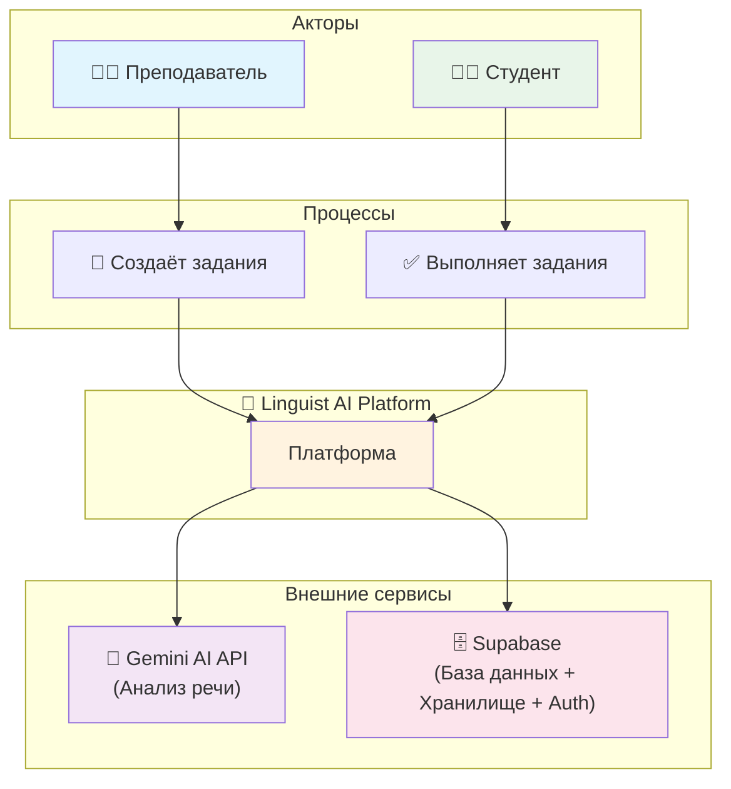

# Диаграммы проекта "Linguist AI"

## Глава 1 - Анализ предметной области

### Рисунок 1: Схема предметной области (Domain Flowchart)

**Описание:** Данная схема демонстрирует основные компоненты предметной области системы Linguist AI. Преподаватель создаёт задания, студенты выполняют их через платформу. Платформа взаимодействует с внешними сервисами: Gemini AI API для анализа речи и Supabase для хранения данных, файлов и аутентификации.

